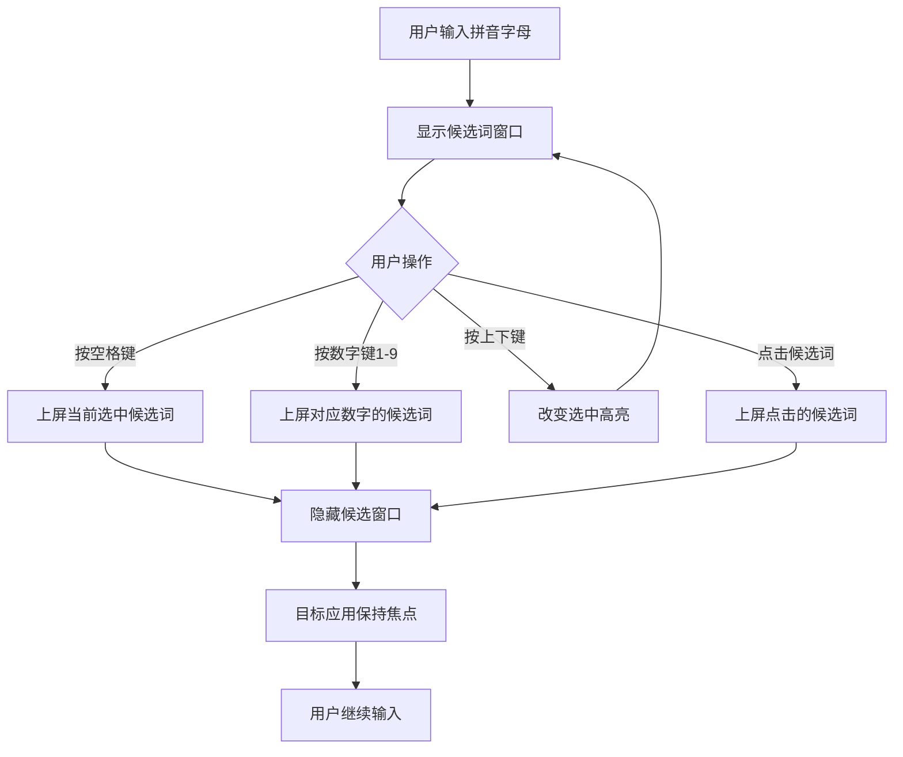
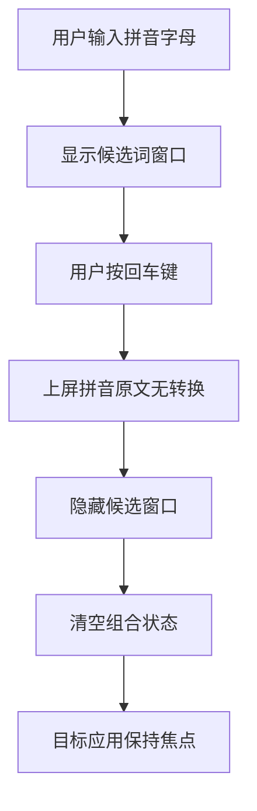
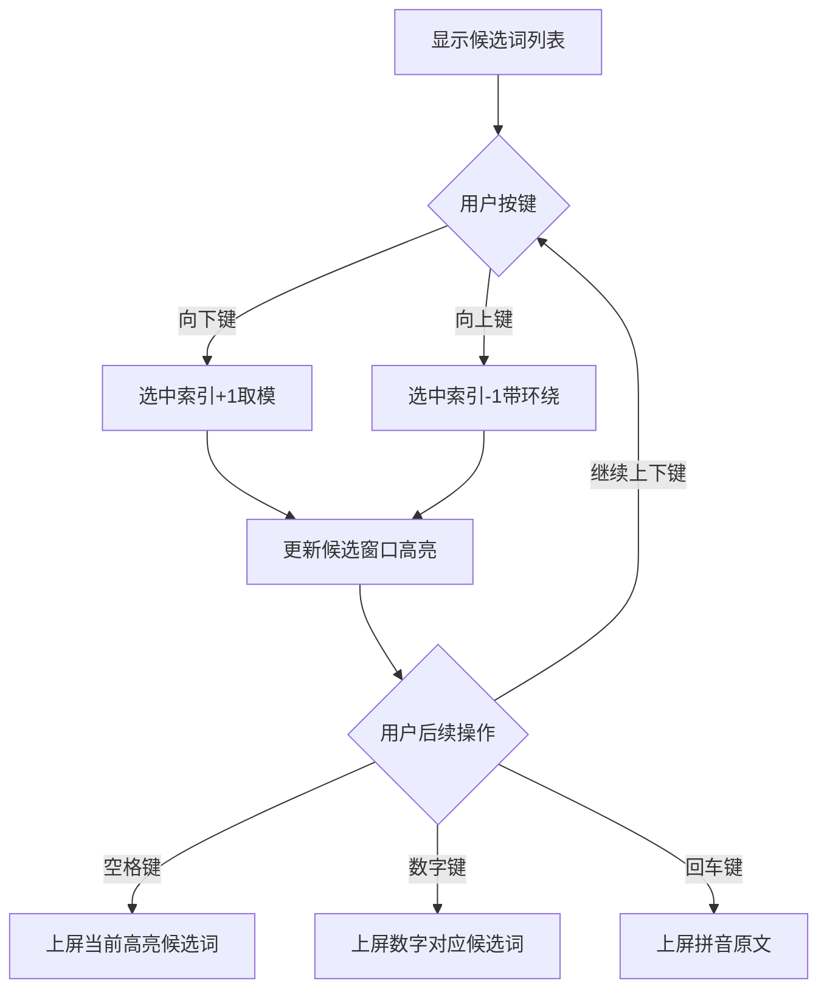
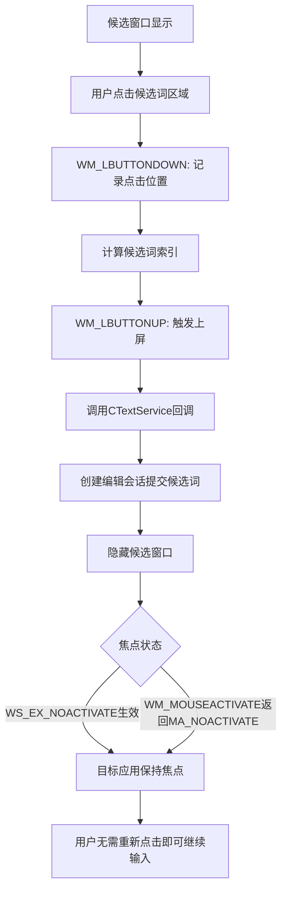

# 输入法候选词交互优化设计

## 一、需求背景

当前输入法在候选词窗口的交互和键盘输入处理方面存在以下问题和改进需求：

### 现有问题
1. **焦点丢失问题**：用户点击候选词窗口时，目标应用程序失去焦点，导致候选词虽然上屏但用户需要重新点击应用程序才能继续输入

### 待实现功能
1. **空格键行为**：按下空格键时应直接选择第一个候选词并上屏（当前已实现）
2. **回车键行为**：按下回车键时应直接将当前输入的所有字母（拼音原文）上屏
3. **数字键选择**：按下数字键（1-9）时选择对应序号的候选词上屏（当前已实现）
4. **上下键导航**：使用上下方向键在候选词列表中移动选择

## 二、问题分析

### 2.1 焦点丢失问题根因

通过分析 `CandidateWindow.cpp` 的窗口创建逻辑，发现候选词窗口使用了以下窗口样式：

```
扩展样式: WS_EX_TOPMOST | WS_EX_NOACTIVATE | WS_EX_TOOLWINDOW
基本样式: WS_POPUP | WS_BORDER
```

**已采取的正确措施**：
- `WS_EX_NOACTIVATE`：防止窗口在显示时自动获得焦点
- `WS_EX_TOOLWINDOW`：不在任务栏显示

**潜在问题**：
- 候选词窗口未处理鼠标点击事件（`WM_LBUTTONDOWN` 等消息）
- 窗口过程 `_WndProc` 只处理了 `WM_PAINT` 消息，其他消息均交由 `DefWindowProc` 处理
- `DefWindowProc` 对鼠标消息的默认处理可能导致焦点切换行为

### 2.2 功能缺失分析

| 功能 | 当前状态 | 需实现内容 |
|-----|---------|-----------|
| 空格选择第一候选词 | ✅ 已实现 | 无 |
| 数字键选择候选词 | ✅ 已实现 | 无 |
| 回车键上屏拼音原文 | ❌ 未实现 | 在 `VK_RETURN` 分支中实现直接上屏原文逻辑 |
| 上下键导航 | ❌ 未实现 | 处理 `VK_UP`/`VK_DOWN`，维护选中索引，刷新候选窗口 |

## 三、设计方案

### 3.1 候选词窗口焦点保持方案

#### 设计目标
用户点击候选词窗口时，应触发候选词上屏，窗口隐藏，且目标应用程序保持激活状态，用户无需重新点击即可继续输入。

#### 实现策略

##### 策略一：鼠标消息拦截与处理（推荐）

在候选词窗口的窗口过程中拦截鼠标点击消息，阻止默认行为并直接处理：

| 消息类型 | 处理逻辑 |
|---------|---------|
| `WM_LBUTTONDOWN` | 计算点击位置对应的候选词索引 |
| `WM_LBUTTONUP` | 触发候选词上屏逻辑，返回0阻止默认处理 |
| `WM_MOUSEACTIVATE` | 返回 `MA_NOACTIVATE` 阻止窗口激活 |

**流程描述**：
1. 用户在候选词窗口上按下鼠标左键时，记录点击位置和计算对应候选词索引
2. 用户释放鼠标左键时，通知 `CTextService` 提交选中的候选词
3. `CTextService` 创建 `CCommitCompositionEditSession` 上屏候选词，清空组合缓冲区，隐藏候选窗口
4. 整个过程中，由于 `WM_MOUSEACTIVATE` 返回 `MA_NOACTIVATE`，候选窗口不会激活，目标应用程序保持焦点

##### 策略二：窗口类样式增强

在窗口类注册时添加 `CS_DBLCLKS` 样式（如需要），确保窗口样式设置正确：
- 保持 `WS_EX_NOACTIVATE`
- 保持 `WS_EX_TOOLWINDOW`
- 保持 `WS_EX_TOPMOST`

#### 候选词索引计算方法

根据候选窗口的布局参数计算点击位置对应的候选词：

**布局参数**：
- `_padding`: 5像素
- `_lineHeight`: 24像素
- 每个候选词占据一行，从 `y = _padding` 开始

**计算公式**：
```
点击的客户区Y坐标 = mouseY
候选词索引 = (mouseY - _padding) / _lineHeight
有效性检查：0 <= 索引 < 候选词数量
```

#### 通知机制设计

候选词窗口需要向 `CTextService` 通知用户的选择行为：

**方法一：回调函数**（推荐）
- `CandidateWindow` 保存指向 `CTextService` 的指针和 `ITfContext` 指针
- 提供设置回调函数接口：`void SetCallback(CTextService* pService, ITfContext* pContext)`
- 点击时直接调用 `CTextService` 的公开方法执行上屏

**方法二：自定义消息**
- 通过 `PostMessage` 向 `CTextService` 持有的主窗口发送自定义消息
- 包含选中索引作为参数
- 缺点：需要额外的窗口消息循环处理

### 3.2 回车键上屏拼音原文功能

#### 行为定义
- 当用户在输入拼音后按下回车键时，直接将当前输入的拼音原文（`_sComposition` 的内容）上屏
- 不进行拼音转汉字的候选词查询
- 上屏后清空组合状态，隐藏候选窗口

#### 实现位置
在 `CTextService::OnKeyDown` 中处理 `VK_RETURN` 消息。

#### 处理流程

| 步骤 | 操作描述 |
|-----|---------|
| 1. 检查状态 | 判断 `_sComposition` 是否为空 |
| 2. 准备上屏文本 | 使用 `_sComposition` 作为提交文本 |
| 3. 创建编辑会话 | 创建 `CCommitCompositionEditSession`，传入拼音原文 |
| 4. 请求编辑会话 | 使用 `TF_ES_SYNC` 或 `TF_ES_ASYNCDONTCARE` 标志请求会话 |
| 5. 清空状态 | 清空 `_sComposition` 和 `_candidateList` |
| 6. 隐藏窗口 | 调用 `_pCandidateWindow->Hide()` |

#### 与空格键的区别
| 按键 | 上屏内容 |
|------|---------|
| 空格 | 第一个候选词（如有），否则拼音原文 |
| 回车 | 拼音原文，不查询候选词 |

### 3.3 上下键候选词导航功能

#### 行为定义
- 按下向下键（`VK_DOWN`）：选中索引向下移动一位，到达底部后循环到顶部
- 按下向上键（`VK_UP`）：选中索引向上移动一位，到达顶部后循环到底部
- 选中索引改变后，候选词窗口应高亮显示当前选中项
- 后续按下空格或回车时，应上屏当前选中的候选词

#### 数据结构增强
在 `CTextService` 中添加或复用选中索引字段：
- `int _selectedCandidateIndex`：当前选中的候选词索引（0-based）
- 初始值为 0（第一个候选词）

#### 索引管理逻辑

**向下导航**：
```
如果 _candidateList 不为空：
    _selectedCandidateIndex = (_selectedCandidateIndex + 1) % _candidateList.size()
刷新候选窗口显示
```

**向上导航**：
```
如果 _candidateList 不为空：
    如果 _selectedCandidateIndex == 0：
        _selectedCandidateIndex = _candidateList.size() - 1
    否则：
        _selectedCandidateIndex = _selectedCandidateIndex - 1
刷新候选窗口显示
```

#### 候选窗口刷新
调用 `_pCandidateWindow->Show(x, y, _candidateList, _selectedCandidateIndex)` 更新显示状态，窗口内部根据 `_selectedIndex` 参数高亮对应项。

#### 按键处理流程

在 `CTextService::OnTestKeyDown` 中：
- 当 `_sComposition.length() > 0` 时，将 `VK_UP` 和 `VK_DOWN` 标记为 eaten

在 `CTextService::OnKeyDown` 中：
- 处理 `VK_UP` 和 `VK_DOWN` 分支
- 更新 `_selectedCandidateIndex`
- 重新显示候选窗口

#### 与其他功能的集成

| 操作 | 行为变化 |
|------|---------|
| 空格键 | 上屏当前选中索引的候选词（而非固定第一个） |
| 数字键 | 直接上屏数字对应索引的候选词（不受当前选中索引影响） |
| 回车键 | 直接上屏拼音原文（不受当前选中索引影响） |

### 3.4 状态管理一致性

#### 状态重置时机
以下操作应重置 `_selectedCandidateIndex` 为 0：
- 输入新的字母（`_sComposition` 内容变化）
- 按下退格键删除字母
- 按下 ESC 键取消输入
- 任何候选词上屏操作完成后

#### 候选词列表更新
当 `_UpdateCandidateWindow` 查询新的候选词列表时，应重置选中索引为 0，因为候选词内容已改变。

## 四、接口变更设计

### 4.1 CandidateWindow 类增强

#### 新增成员变量

| 变量名 | 类型 | 用途 |
|--------|------|------|
| `_pTextService` | `CTextService*` | 指向所属的文本服务实例，用于回调 |
| `_pContext` | `ITfContext*` | 当前输入上下文，用于编辑会话 |

#### 新增公开方法

| 方法签名 | 功能描述 |
|---------|---------|
| `void SetCallback(CTextService* pService, ITfContext* pContext)` | 设置回调指针，在候选词被点击时通知文本服务 |

#### 修改的窗口过程消息处理

| 消息 | 新增处理逻辑 |
|------|-------------|
| `WM_MOUSEACTIVATE` | 返回 `MA_NOACTIVATE` |
| `WM_LBUTTONDOWN` | 计算点击位置，记录候选词索引 |
| `WM_LBUTTONUP` | 通知 `CTextService` 提交选中候选词，返回 0 |

### 4.2 CTextService 类增强

#### 新增成员变量

| 变量名 | 类型 | 初始值 | 用途 |
|--------|------|--------|------|
| `_selectedCandidateIndex` | `int` | 0 | 当前选中的候选词索引 |

#### 新增公开方法

| 方法签名 | 功能描述 |
|---------|---------|
| `void CommitCandidate(ITfContext* pContext, int index)` | 根据索引提交指定候选词，供候选窗口回调使用 |

#### 修改的按键处理逻辑

| 按键 | 新增或修改逻辑 |
|------|---------------|
| `VK_RETURN` | 新增：直接上屏 `_sComposition` 原文 |
| `VK_UP` | 新增：向上移动选中索引，刷新窗口 |
| `VK_DOWN` | 新增：向下移动选中索引，刷新窗口 |
| `VK_SPACE` | 修改：上屏 `_candidateList[_selectedCandidateIndex]` 而非固定 `[0]` |
| 字母键 | 修改：重置 `_selectedCandidateIndex = 0` |
| `VK_BACK` | 修改：重置 `_selectedCandidateIndex = 0` |
| `VK_ESCAPE` | 修改：重置 `_selectedCandidateIndex = 0` |

## 五、实现要点

### 5.1 候选词点击处理的线程安全性

#### 考虑因素
- 候选词窗口的鼠标消息在窗口线程中处理
- TSF 编辑会话需要在正确的线程上下文中执行
- `ITfContext` 和相关 TSF 对象可能有线程亲和性

#### 推荐方案
- 在鼠标点击处理中，不直接执行编辑会话
- 而是通过安全的方式通知 `CTextService`，由其在合适的时机执行上屏操作
- 如果 `CTextService` 和候选窗口在同一线程（通常是这样），则可以直接调用方法

### 5.2 候选词索引边界检查

在所有使用 `_selectedCandidateIndex` 访问 `_candidateList` 的地方，必须进行边界检查：

**检查条件**：
```
_candidateList.size() > 0 
且 _selectedCandidateIndex >= 0 
且 _selectedCandidateIndex < _candidateList.size()
```

### 5.3 窗口样式验证

确认候选窗口的窗口样式设置正确：
- `WS_EX_NOACTIVATE`：必须存在
- `CS_IME` 窗口类样式：已正确设置
- 窗口过程中正确处理 `WM_MOUSEACTIVATE`

### 5.4 回车键与 ESC 键的区别

| 按键 | 行为 |
|------|------|
| 回车 | 上屏拼音原文，完成输入 |
| ESC | 取消输入，不上屏任何内容，清空组合 |

### 5.5 候选窗口位置刷新策略

当仅改变选中索引（上下键导航）而组合内容未变化时：
- 可以复用上次计算的窗口位置
- 无需重新查询光标位置
- 仅调用 `Show` 方法更新显示内容和高亮状态

## 六、用户交互流程

### 6.1 标准输入流程（使用空格或数字键）



### 6.2 回车键上屏原文流程



### 6.3 上下键导航流程



### 6.4 鼠标点击候选词流程



## 七、风险与约束

### 7.1 技术风险

| 风险项 | 影响 | 缓解措施 |
|--------|------|---------|
| 某些应用程序的 TSF 实现特殊，可能导致焦点行为不一致 | 部分应用点击候选词后仍失去焦点 | 在常见应用（记事本、Word、浏览器）中充分测试 |
| 异步编辑会话可能导致候选词提交延迟 | 用户感知上屏有延迟 | 优先使用同步编辑会话，失败时降级为异步 |
| 候选词索引管理错误导致越界访问 | 程序崩溃 | 所有访问前进行严格边界检查 |

### 7.2 用户体验约束

| 约束项 | 说明 |
|--------|------|
| 候选词数量限制 | 当前设计未限制数量，但界面布局需考虑过多候选词导致窗口过大 |
| 上下键导航范围 | 仅在当前显示的候选词列表内导航，不支持翻页 |
| 鼠标点击精度 | 依赖用户点击的像素位置计算索引，需确保布局参数与绘制逻辑一致 |

### 7.3 兼容性约束

| 系统/应用 | 已知问题 | 处理方案 |
|-----------|---------|---------|
| Windows 10/11 | 标准支持 | 无 |
| UWP 应用 | 某些 UWP 应用的 TSF 支持可能受限 | 尽力而为，记录已知问题 |
| 虚拟机环境 | 鼠标消息和焦点行为可能受虚拟化层影响 | 提示用户在物理机测试 |

## 八、测试验证要点

### 8.1 功能测试

| 测试项 | 验证内容 |
|--------|---------|
| 回车键上屏 | 输入拼音后按回车，验证上屏的是拼音原文而非候选词 |
| 空格键上屏 | 按空格后验证上屏当前选中的候选词（默认第一个） |
| 数字键选择 | 按 1-9 验证上屏对应序号的候选词 |
| 向下键导航 | 按向下键多次，验证高亮索引循环变化 |
| 向上键导航 | 按向上键多次，验证高亮索引循环变化 |
| 上下键后空格 | 用上下键选中非第一项后按空格，验证上屏选中项 |

### 8.2 焦点保持测试

| 测试场景 | 验证内容 |
|---------|---------|
| 记事本中点击候选词 | 验证上屏后光标仍在记事本，无需重新点击 |
| Word 中点击候选词 | 验证上屏后可立即继续输入 |
| 浏览器文本框点击候选词 | 验证焦点保持在文本框 |
| 候选窗口显示时不影响应用 | 候选窗口显示不导致应用失焦 |

### 8.3 边界条件测试

| 测试场景 | 预期行为 |
|---------|---------|
| 只有一个候选词时按上下键 | 高亮保持不变或循环到自身 |
| 候选词列表为空时按上下键 | 无操作或保持安全状态 |
| 按数字键但索引超出范围 | 无操作，不崩溃 |
| 点击候选窗口边缘空白区域 | 不触发上屏或安全忽略 |

### 8.4 回归测试

| 测试项 | 验证内容 |
|--------|---------|
| 原有功能不受影响 | 字母输入、退格、ESC 等基础功能正常 |
| 候选词查询功能 | 词库查询逻辑不受新功能影响 |
| 窗口位置计算 | 候选窗口位置跟随光标正常 |

## 九、性能考虑

### 9.1 响应延迟要求

| 操作 | 目标响应时间 |
|------|------------|
| 按键触发候选词刷新 | < 50ms |
| 上下键导航高亮变化 | < 20ms |
| 鼠标点击上屏 | < 100ms |

### 9.2 优化策略

- 上下键导航时不重新查询词库，仅刷新显示
- 候选窗口位置在组合内容不变时无需重新计算
- 鼠标点击索引计算使用简单算术运算，无需复杂遍历

## 十、后续扩展可能性

### 10.1 功能增强方向

| 功能 | 描述 |
|------|------|
| 分页支持 | 支持 PageUp/PageDown 翻页查看更多候选词 |
| 候选词排序优化 | 基于用户历史输入调整候选词顺序 |
| 快捷键自定义 | 允许用户自定义上屏和导航按键 |

### 10.2 界面优化方向

| 优化点 | 描述 |
|--------|------|
| 候选词预览 | 显示候选词的拼音或释义 |
| 动画效果 | 高亮切换时添加平滑过渡效果 |
| 主题支持 | 支持深色模式和自定义颜色方案 |
